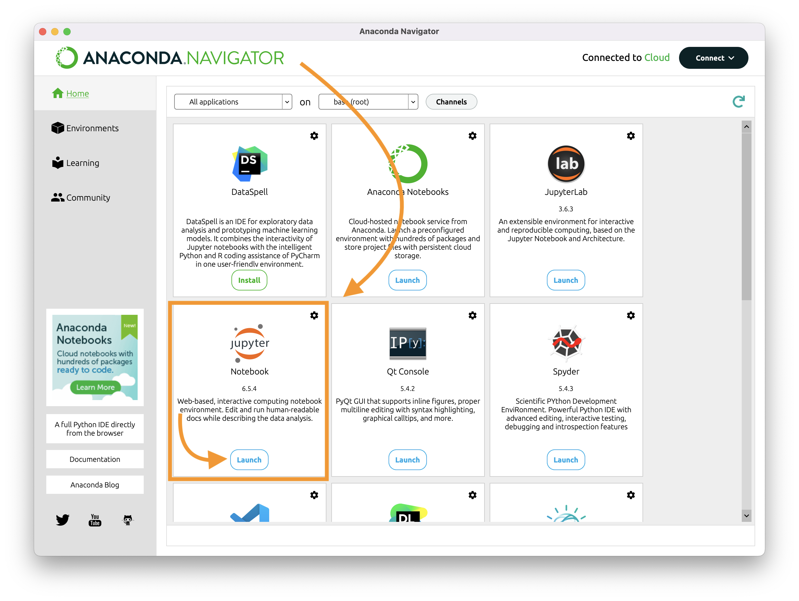
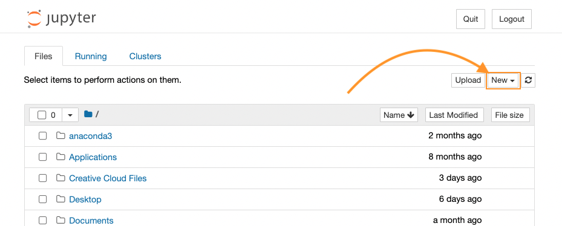
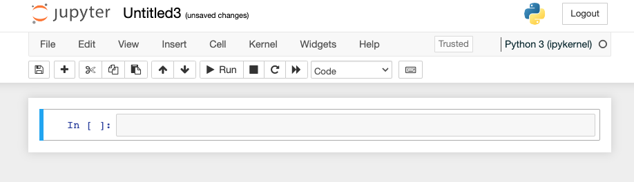

# Instructions for chapter 4

Montfort's Chapter 4, "Calculating and Using Jupyter Notebook," is mostly intended to get you used to writing small snippets of Python code in the Jupyter Notebook interactive interface. While most of the examples are simple math, the bigger lessons here are to see how *error reporting* works in your favor, and to draw a useful distinction between **valid** programs (i.e. syntactically correct, compiling) and **intentional** programs (i.e. programs that do what you want).

- NB: Toward the end of the chapter, there's a somewhat interesting digression on the history of HTML and why you can write invalid HTML and it'll still load in your browser. By all means read it if the first part goes quickly! But if you need to skip this to get to the more exciting stuff in chapter 5, go ahead and save section 4.5 for another day.

## 1. Open a new Jupyter Notebook in your repo

1. Run the Anaconda Navigator app
2. In the list of programs that appears, find Jupyter Notebook and click "Launch."
3. You may see a command line pop up and run some things; be patient. Eventually you'll get a browser window pointed to localhost:8888/tree.
4. The files shown are on your own computer, even though you're seeing them in a web browser! Go ahead and navigate to your DSAM folder, or (even better) your dsam-montfort folder.
4. To start a new notebook, look for the "New" button above the table of files. Click on it and select Python 3 (ipykernel).

Show me

<figure style="margin-bottom: 2em;">
    </img>
    <figcaption>Don't be fooled by JupyterLab or Anaconda Notebooks; the one we want is Jupyter Notebook.</figcaption>
</figure>
<figure style="margin-bottom: 2em;">
    </img>
    <figcaption>Notice the similarity to the GitHub interface? (We could use that high-contrast color to highlight the New file button, but alas.)</figcaption>
</figure>
<figure style="margin-bottom: 2em;">
    </img>
    <figcaption>When you see a cell inviting you "In [ ]:" you've made it.</figcaption>
</figure>

## 2. Read and do

Follow along with <a class="alert-link" href="https://mitpress.ublish.com/ebook/epah2e-preview/12629/39">the chapter</a>. Each time you come to a bit of code in the book, enter it in your own Jupyter Notebook and press Shift-Enter to run it.

## 3. Save and commit

As you work, periodically stop to save your progress using File > Save As or the disc icon.

<figure>
    
</figure>

When you finish the chapter, commit and push your changes to the repo.

Then continue to [chapter 5](README-ch5.md).
